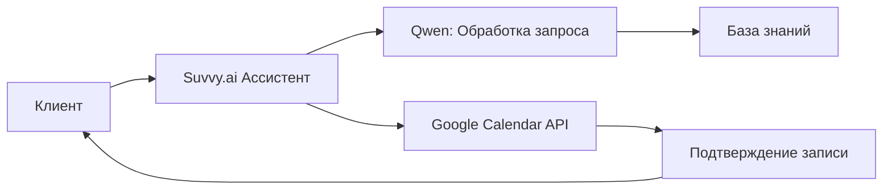

# 🤖 AI-Студия Лина ассистент

> Интеллектуальный ИИ-ассистент для автоматизации коммуникации с клиентами, консультаций и записи на встречи

---

## 📋 Оглавление

1. [Общее описание](#-общее-описание)
2. [Цели и задачи](#-цели-и-задачи)
3. [Функциональные возможности](#-функциональные-возможности)
4. [Техническая архитектура](#-техническая-архитектура)
5. [Используемые сервисы и технологии](#-используемые-сервисы-и-технологии)
6. [База знаний и промпт-инжиниринг](#-база-знаний-и-промпт-инжиниринг)
7. [Интеграции](#-интеграции)
8. [Сценарии использования](#-сценарии-использования)
9. [Преимущества решения](#-преимущества-решения)
10. [План развития](#-план-развития)
11. [Технические требования](#-технические-требования)

---

## 📝 Общее описание

**AI-Студия Лина ассистент** — это интеллектуальный виртуальный помощник, созданный для автоматизации первичного общения с клиентами студии. Ассистент способен вести осмысленный диалог, отвечать на частые вопросы на основе внутренней базы знаний и самостоятельно записывать клиентов на консультации с синхронизацией в Google Календарь.

Проект реализован на платформе **Suvvy.ai** с использованием языковой модели **Qwen** для настройки логики поведения и формирования базы знаний.



---

## 🎯 Цели и задачи

### Основные цели:
- ✅ Снизить нагрузку на оператора за счёт автоматизации рутинных запросов
- ✅ Обеспечить мгновенные ответы клиентам 24/7
- ✅ Увеличить конверсию в запись за счёт упрощения процесса бронирования
- ✅ Сохранить единый стиль коммуникации и тональность бренда

### Задачи проекта:
- Настроить диалоговый движок для естественного общения
- Структурировать и загрузить базу знаний студии
- Реализовать интеграцию с Google Calendar для управления расписанием
- Обеспечить валидацию данных при записи клиента
- Протестировать сценарии и доработать edge-кейсы

---

## ⚙️ Функциональные возможности

### 💬 Осмысленное ведение диалога
- Распознавание намерений пользователя (intent recognition)
- Контекстное понимание: ассистент «помнит» предыдущие реплики в рамках сессии
- Поддержка естественного языка с учётом стилистики бренда
- Корректная обработка уточняющих вопросов и возражений
- Плавный переход к целевому действию (запись, ответ на вопрос)

### 📚 Ответы на вопросы по базе знаний
- Поиск релевантных ответов в структурированной базе знаний
- Автоматическое формирование ответов на частые вопросы:
  - Услуги и цены
  - Формат консультаций (онлайн/офлайн)
  - Длительность сессий
  - Политика отмены и переноса
  - Контакты и реквизиты
- Возможность дообучения базы по мере появления новых вопросов

### 🗓️ Запись на консультацию + Google Calendar
- Пошаговый сценарий записи:
  1. Уточнение типа услуги
  2. Выбор удобной даты и времени
  3. Сбор контактных данных (имя, телефон, email)
  4. Подтверждение записи и отправка уведомления
- Автоматическая проверка доступных слотов в реальном времени
- Добавление события в Google Календарь с метаданными:
  - Название встречи
  - Время начала/окончания
  - Описание с данными клиента
  - Ссылка на онлайн-встречу (при необходимости)
- Отправка подтверждения клиенту (в чате / на почту)

---

## 🏗️ Техническая архитектура

```
┌─────────────────────────────────┐
│         Клиент (мессенджер/сайт) │
└─────────┬───────────────────────┘
          │
          ▼
┌─────────────────────────────────┐
│        Suvvy.ai Platform         │
│  • Диалоговый менеджер          │
│  • Обработчик намерений         │
│  • Интеграционный слой          │
└─────────┬───────────────────────┘
          │
    ┌─────┴─────┐
    ▼           ▼
┌────────┐ ┌──────────────┐
│ Qwen   │ │ Google Cloud │
│ • LLM  │ │ • Calendar API│
│ • Промпт│ │ • Auth OAuth2│
│ • RAG  │ │ • Webhooks  │
└────────┘ └──────────────┘
          │
          ▼
┌─────────────────────────────────┐
│        Хранилище данных          │
│  • База знаний (JSON/Markdown)  │
│  • Логи диалогов                │
│  • Кэш ответов                  │
└─────────────────────────────────┘
```

---

## 🛠️ Используемые сервисы и технологии

| Сервис | Назначение | Ссылка |
|--------|------------|--------|
| **Qwen** | Генерация системного промпта, формирование и оптимизация базы знаний, RAG-поиск | [qwen.ai](https://qwen.ai) |
| **Suvvy.ai** | Платформа для создания и развертывания ИИ-ассистента, управление диалогами, интеграции | [suvvy.ai](https://suvvy.ai/) |
| **Google Calendar API** | Синхронизация записей, проверка доступности слотов, управление событиями | [developers.google.com/calendar](https://developers.google.com/calendar) |
| **Google OAuth 2.0** | Безопасная авторизация для доступа к календарю | [developers.google.com/identity](https://developers.google.com/identity) |

### Дополнительные инструменты:
- **JSON/YAML** — формат хранения базы знаний и конфигураций
- **Webhooks** — обработка событий и уведомлений
- **Logging & Monitoring** — отслеживание качества диалогов и метрик конверсии

---

## 🧠 База знаний и промпт-инжиниринг

### Структура базы знаний (пример):
```markdown
## Услуги
- Название: Индивидуальная консультация
  Длительность: 60 минут
  Формат: Онлайн (Zoom) / Офлайн
  Стоимость: 5 000 ₽
  Описание: Персональная сессия по вашему запросу...

## Политика отмены
- Отмена возможна за 24 часа до встречи
- Перенос — бесплатно, при условии уведомления заранее
- Возврат средств: согласно договору оферты

## Контакты
- Телефон: +7 (XXX) XXX-XX-XX
- Email: hello@linastudio.ru
- Соцсети: @linastudio (VK, Telegram)
```

### Системный промпт (фрагмент):
```
Ты — виртуальный ассистент студии «Лина». Твоя задача:
1. Дружелюбно и профессионально общаться с клиентами.
2. Отвечать на вопросы, используя только предоставленную базу знаний.
3. Помогать записаться на консультацию, собирая: имя, контакт, услугу, дату/время.
4. Не придумывать информацию, которой нет в базе. Если не знаешь ответа — честно скажи и предложи связаться с оператором.
5. Сохраняй тёплый, поддерживающий тон, соответствующий ценностям студии.
```

### Принципы работы с промптом:
- Чёткое разделение ролей: ассистент ≠ человек, но сохраняет эмпатию
- Ограничение на «выдумки» (no hallucination policy)
- Приоритет безопасности данных: не запрашивать лишнюю персональную информацию
- Поддержка мультиязычности (при необходимости)

---

## 🔗 Интеграции

### Google Calendar
```yaml
integration:
  provider: google_calendar
  auth: oauth2
  scopes:
    - https://www.googleapis.com/auth/calendar.events
  actions:
    - check_availability: поиск свободных слотов
    - create_event: создание встречи с метаданными
    - update_event: изменение времени по запросу клиента
    - send_confirmation: уведомление после записи
```

### Обработка событий (webhook example):
```json
{
  "event": "appointment_booked",
  "data": {
    "client_name": "Анна",
    "service": "Консультация",
    "datetime": "2026-05-20T15:00:00+03:00",
    "contact": "anna@example.com",
    "calendar_event_id": "abc123xyz"
  }
}
```

---

## 🔄 Сценарии использования

### Сценарий 1: Ответ на вопрос об услуге
```
Клиент: Сколько стоит консультация?
Ассистент: Индивидуальная консультация длится 60 минут и стоит хххх ₽. 
           Провожу онлайн (Zoom) или при личной встрече. 
           Хотите записаться? 😊
```

### Сценарий 2: Запись на встречу
```
Клиент: Хочу записаться на консультацию
Ассистент: Отлично! 🌟 Подскажите, пожалуйста:
           1. Вам удобнее онлайн или офлайн?
           2. На какой дате и времени хотели бы встретиться?

[После ответов]
Ассистент: Проверила расписание — 20 мая в 15:00 свободно! 
           Для подтверждения напишите, пожалуйста, ваше имя и контактный телефон.

[После подтверждения]
Ассистент: Готово! ✨ Встреча «Консультация с Линой» добавлена в календарь на 20.05 в 15:00. 
           Напоминание придёт за час до начала. Жду вас! 💫
```

### Сценарий 3: Обработка возражения
```
Клиент: А если я не смогу прийти?
Ассистент: Понимаю, планы могут меняться 🤍 
           Отменить или перенести встречу можно бесплатно, 
           если сообщить об этом за 24 часа до начала. 
           Просто напишите мне — я помогу всё организовать.
```

---

## ✨ Преимущества решения

| Преимущество | Описание |
|--------------|----------|
| 🕒 24/7 доступность | Клиенты получают ответы мгновенно, независимо от времени суток |
| 📈 Рост конверсии | Упрощённый процесс записи снижает барьер и увеличивает число бронирований |
| 💰 Экономия ресурсов | Снижение нагрузки на оператора до 70% на этапе первичного контакта |
| 🎯 Единый стандарт | Все клиенты получают информацию в одном стиле и тоне |
| 📊 Аналитика | Логи диалогов помогают выявлять частые вопросы и улучшать сервис |
| 🔒 Безопасность | Данные клиентов обрабатываются в соответствии с политикой конфиденциальности |

---

## 🚀 План развития

### Краткосрочные улучшения (1-2 месяца)
- [ ] Подключение аналитики диалогов (метрики: среднее время ответа, % успешных записей)
- [ ] Добавление шаблонов быстрых ответов для оператора (ручное переключение)
- [ ] Настройка email-уведомлений с деталями встречи

### Среднесрочные (3-4 месяца)
- [ ] Интеграция с платежной системой для предоплаты
- [ ] Поддержка голосового ввода (speech-to-text)
- [ ] Мультиязычность: английский + русский

### Долгосрочные (6+ месяцев)
- [ ] Персонализация: учёт истории обращений клиента
- [ ] Прогнозирование лучших слотов на основе поведения пользователей
- [ ] Экспорт отчётов в CRM (AmoCRM / Bitrix24)

---

## 📋 Технические требования

### Минимальные требования для запуска:
- Аккаунт в [Suvvy.ai](https://suvvy.ai/) с тарифом, поддерживающим интеграции
- Доступ к модели Qwen (через API или платформу)
- Настроенный Google Cloud Project с включённым Calendar API
- SSL-сертификат для webhook-эндпоинтов (при размещении на своём сервере)

### Рекомендуемые настройки:
- Таймаут ответа ассистента: ≤ 3 секунд
- Резервное копирование базы знаний: ежедневно
- Логирование всех диалогов с возможностью экспорта
- Тестовый режим перед публикацией для проверки сценариев

---

## 📬 Поддержка и документация

- 📘 [Документация Suvvy.ai](https://suvvy.ai/docs)
- 🔧 [API Reference Qwen](https://qwen.ai/api)
- 📅 [Google Calendar API Guide](https://developers.google.com/calendar/api/guides/overview)
- 🆘 Внутренняя база знаний проекта (доступна команде)
